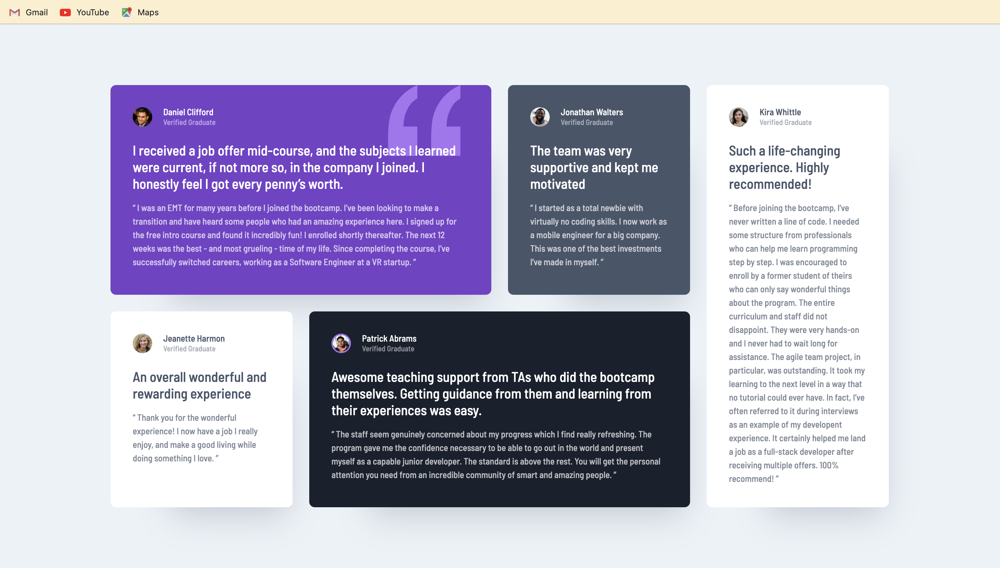

# Testimonials grid section

A responsive feedback layout

## Table of contents

- [Overview](#overview)
  - [Screenshot](#screenshot)
  - [Links](#links)
- [My process](#my-process)
  - [Built with](#built-with)
  - [Continued development](#continued-development)
  - [Useful resources](#useful-resources)
- [Author](#author)

## Overview

This project helped me understand the grid layout in CSS and neat little tricks to use in responsive design and improve user experience..

### Screenshot

### Links

- Solution URL: [Github URL](https://github.com/Kashyxp-patel/Testimonials-grid-section)
- Live Site URL: [Live site URL]()

### Built with
- HTML
- CSS

### Continued development

Integrate it with a full-stack page and make a website stand out

### Useful resources

- [W3 Schools](https://www.w3schools.com/cssref/index.php)
- [MDN Web Docs](https://developer.mozilla.org/en-US/docs/Web/CSS)

## Author

- GitHub - [Github](https://github.com/Kashyxp-patel)
- Frontend Mentor - [Kashyxp-patel](https://www.frontendmentor.io/profile/Kashyxp-patel)

